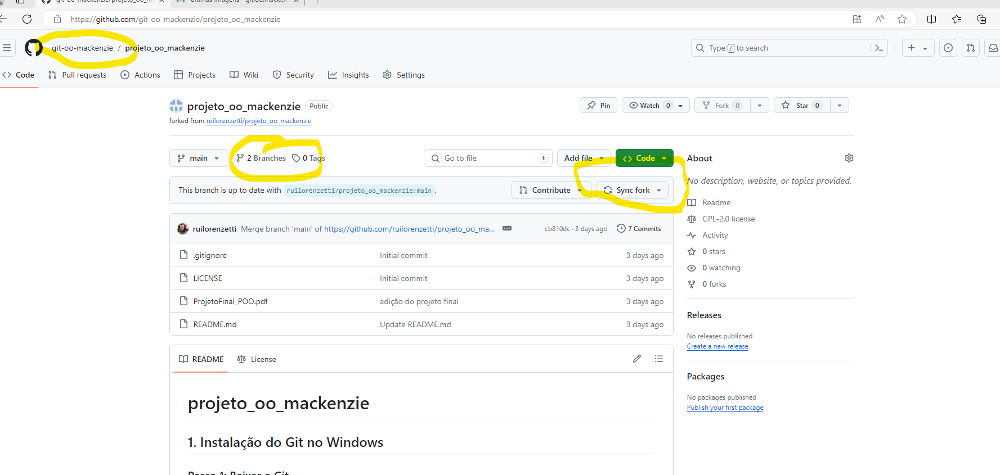
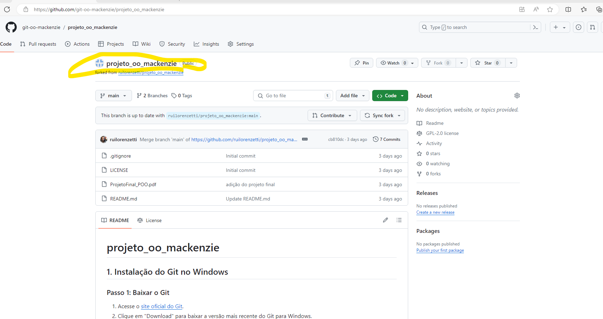
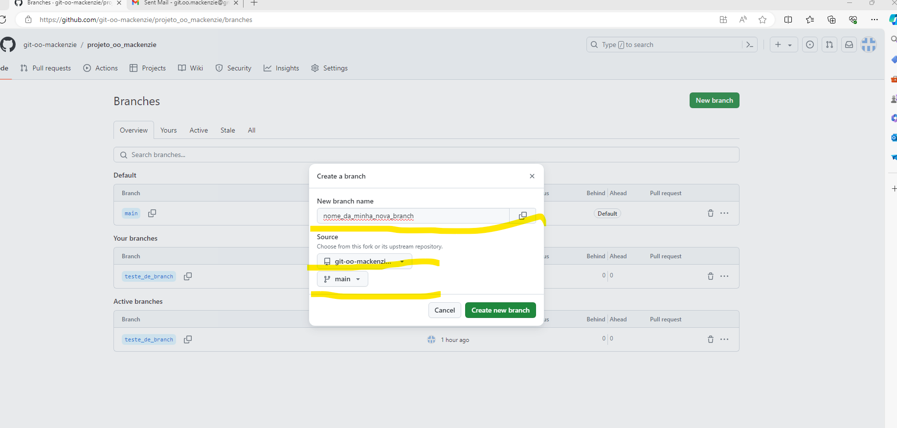
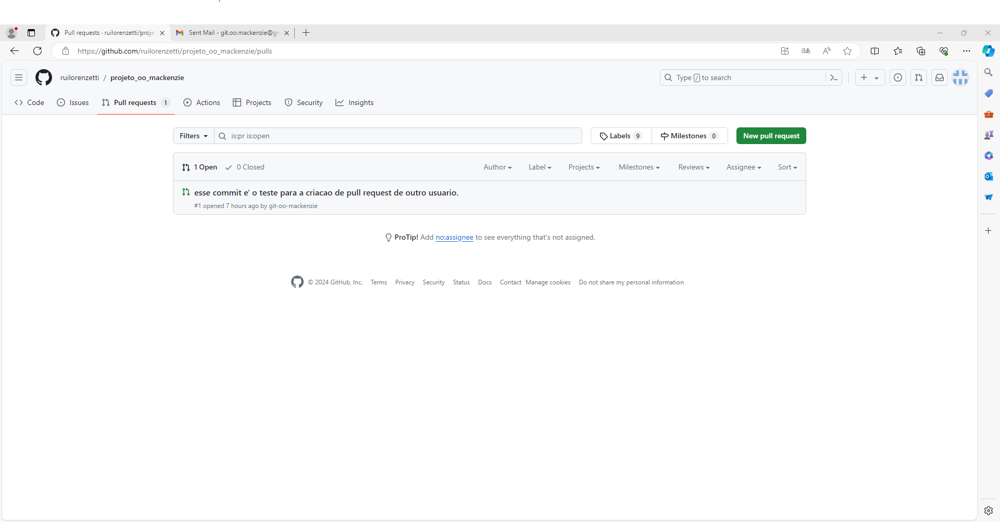
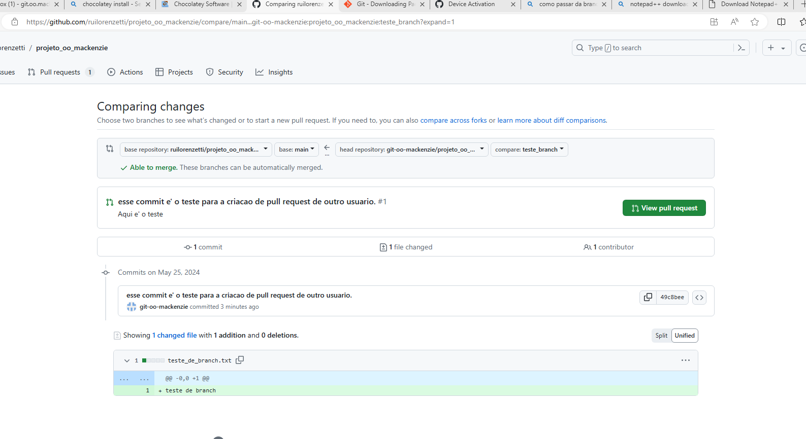
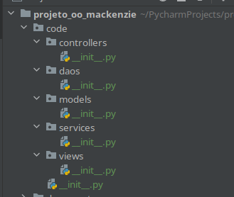

# projeto_oo_mackenzie

* O projeto roda em Python 3.10 e o arquivo, os pacotes necessarios estão no arquivo requirements.txt, para rodar o projeto entre dentro da pasta projeto_oo_mackenzie e execute `python -m views.login_screen` 

* Para fazer o login como atendente o usuario inicial é: maria@example.com e a senha é: senha123
* Para fazer o login como cliente o usuario inicial é: joao@example.com e a senha é: 123

<!-- TOC -->
* [projeto_oo_mackenzie](#projeto_oo_mackenzie)
  * [Instalação do Git no Windows](#1-instalação-do-git-no-windows)
    * [Passo 1: Baixar o Git](#passo-1-baixar-o-git)
    * [Passo 2: Instalar o Git](#passo-2-instalar-o-git)
    * [Passo 3: Verificar a Instalação](#passo-3-verificar-a-instalação)
  * [Git fluxo baśico fork e git clone/add/commit/pull/push](#4-git-fluxo-baśico-fork-e-git-cloneaddcommitpullpush)
    * [Passo 1: Fazer o fork do projeto original](#passo-1-fazer-o-fork-do-projeto-original-)
    * [Clonagem de Repositórios](#clonagem-de-repositórios)
        * [Passo 1: Obter a URL do Repositório](#passo-1-obter-a-url-do-repositório)
      * [Passo 2: Clonar o Repositório](#passo-2-clonar-o-repositório)
      * [Passo 3: Execute o comando de clonagem:](#passo-3-execute-o-comando-de-clonagem)
    * [Criação de Branches](#criação-de-branches)
      * [Passo 1: Criar uma Nova Branch](#passo-1-criar-uma-nova-branch)
      * [Passo 2: Verificar Branch Atual](#passo-2-verificar-branch-atual)
      * [Passo 3: Realize as suas mudanças](#passo-3-realize-as-suas-mudanças)
    * [Passo 4: Adição dos arquivos para ao commit](#passo-4-adição-dos-arquivos-para-ao-commit)
    * [Enviar a Branch para o Repositório Remoto](#enviar-a-branch-para-o-repositório-remoto)
    * [Passo 3: Criar um Pull Request](#passo-3-criar-um-pull-request)
  * [Resumo dos Comandos](#resumo-dos-comandos)
  * [Estrutura de alto nivel do projeto](#estrutura-de-alto-nivel-do-projeto-)
    * [Estrutura Básica do Projeto](#estrutura-básica-do-projeto)
    * [Explicação dos Componentes](#explicação-dos-componentes)
    * [Conclusão](#conclusão)
<!-- TOC -->
## 1. Instalação do Git no Windows

### Passo 1: Baixar o Git
1. Acesse o [site oficial do Git](https://git-scm.com/).
2. Clique em "Download" para baixar a versão mais recente do Git para Windows.

### Passo 2: Instalar o Git
1. Execute o instalador baixado.
2. Siga as instruções do instalador:
   - **Selecionar componentes**: Deixe as opções padrão selecionadas, a menos que você tenha necessidades específicas.
   - **Configurações do terminal**: Recomendo usar o "Git Bash" como terminal padrão.
   - **Configurações de linha de comando**: Selecione "Use Git from the Windows Command Prompt" para facilitar o uso do Git em diferentes terminais.
   - **Configurações de CRLF**: Se você não tiver uma preferência específica, use a opção recomendada para converter final de linha (Checkout Windows-style, commit Unix-style).

### Passo 3: Verificar a Instalação
1. Abra o Git Bash ou o Prompt de Comando.
2. Digite `git --version` para verificar se o Git foi instalado corretamente.

## 4. Git fluxo baśico fork e git clone/add/commit/pull/push

### Passo 1: Fazer o fork do projeto original 
0. Crie um fork do projeto https://github.com/ruilorenzetti/projeto_oo_mackenzie 
na sua conta do github para isso faça o seguinte:

   A) Realize o login na sua conta do github,

   B) Procure na caixa de pesquisa ruilorenzetti/projeto_oo_mackenzie
   ou navegue no browser em que você realizou o login para: https://github.com/ruilorenzetti/projeto_oo_mackenzie

   Clique no seguinte botão para realizar o fork do projeto para sua conta.
### Clonagem de Repositórios
   ##### Passo 1: Obter a URL do Repositório
      1. Vá até a página do repositório no GitHub (ou outra plataforma Git).
      2. Clique no botão "Code" e copie a URL do repositório.
   #### Passo 2: Clonar o Repositório
      1. Abra o Git Bash.
      2. Navegue até o diretório onde você deseja clonar o repositório:
         
            cd caminho/para/o/diretorio
         
   #### Passo 3: Execute o comando de clonagem:
   ```sh
   git clone URL_DO_REPOSITORIO
   ```
   _**Substitua `URL_DO_REPOSITORIO` pela URL que você copiou do seu projeto depois do FORK.**_

### Criação de Branches

   #### Passo 1: Criar uma Nova Branch
      1. No Git Bash, navegue até o diretório do seu repositório clonado.
      2. Crie uma nova branch e mude para ela:
      
      git checkout -b nome-da-branch
      

   #### Passo 2: Verificar Branch Atual
      1. Para verificar em qual branch você está, use:
        
         git branch

   #### Passo 3: Realize as suas mudanças

      Aqui nesse passo você poderá trabalhar efetivamente no projeto para realizarr as suas alterações no código 

   ### Passo 4: Adição dos arquivos para ao commit
      1. Adicione os arquivos alterados ao commit:
  
         git add .
   
      2. Faça o commit das suas mudanças:
      
         git commit -am "Mensagem do commit"
      
         coloque uma mensagem que tenh significado paro o commit que será realizado 

### Enviar a Branch para o Repositório Remoto
   1. Envie sua branch para o repositório remoto:
   Caso seja o primeiro push que voc^e ser
      ```sh
      git push origin nome-da-branch
      ```
   Caso não seja o primeiro commit que você irá executar, pode mandar executar
      ```
      git push
      ```
### Passo 3: Criar um Pull Request
1. Vá até a página do SEU repositório (o que foi criado na SUA conta  partir do fork do projeto original) no GitHub.
   
   <BR>
   <BR>
   Na imagem acima:
   * **Perceba o nome ddo seu usuário no canto superior a esquerda**_<BR>
   * **_Perceba o link para "Branches" de onde você pode criar a branch no SEU projeto
   (O que você criou a partir do fork do projeto original)_**<BR>
   * **_PERCEBA O BOTÃO "Sync fork" QUE VOCÊ DEVE CLICAR SEMPRE ANTES DE EXECUTAR UM "git commit" ou 
   "git push"_**
   <BR>
   <BR>
2. Clique no nome do seu projeto (imagem abaixo).
   <BR>
   <BR>
   
3. Preencha os dados da branch (imagem abaixo) e confira os combo box que destacados na imgem  
   **Ele deve ter o seu nome de usuario e deve ser criado a partir do main do seu projeto**
   **O nome da sua nova branch (Não deve ter espaços nem caracteres especiais**
   <BR>
   <BR>
   
4. Rellize as mudanças no seu código 
   * Depois de realizar s mudanças, clique no botão no painel do seu repositório no github do seu
     projeto "Sync Fork" conforme descrito anteriormente  no tutorial.
   * Realize o fluxo de ``` git add .``` ->  ```git commit -am "coloque sua mensagem aqui" .```  -> ```git push```   
5. Clique em Create Pull request no botão verde no painel do seu repositorio dentro do link "branches" do seu projeto
   <BR>
   <BR>
    
6. Preencha os detalhes do pull request e clique em "Create pull request":
   <BR>
   <BR>
   
   <BR>
   <BR>
    * Observe que a caixa "Base Repository" signiifica para qual repositorio deve ser integrado o seu código
    * Observe que a caixa "base" significa para qual branch no repositorio remoto irá o seu código
    * Observe que a caixa "head repository" significa de qual repositorio ira vir as mudanças (ou seja o seu repositorio)
    * Observe que a caixa "compare" vai apontar para o nome da branch que tem as suas mudanças (não pode ser o ramo main do eu projeto)
    <BR>
    <BR>
    _**Depois que terminar avise no grupo da sala sobre o seu pull request**_


## Resumo dos Comandos

- **Instalar Git**: `git --version`
- **Clonar Repositório**: `git clone URL_DO_REPOSITORIO`
- **Criar Branch**: `git checkout -b nome-da-branch`
- **Verificar Branch**: `git branch`
- **Adicionar Alterações**: `git add .`
- **Fazer Commit**: `git commit -am "Mensagem do commit"`
- **Enviar Branch**: `git push origin nome-da-branch`

  Se você tiver dificuldades com as senhas, você precisa criar um cache de autenticação que é descrito na seguinte url:
  <br> https://docs.github.com/en/get-started/getting-started-with-git/about-remote-repositories#cloning-with-https-urls

## Estrutura de alto nivel do projeto 

   

   A partir da estrutura do projeto iremos desenhar um diagrama pra entendermos 
   as dependências entre os pacotes em questão.

### Estrutura Básica do Projeto

**Diagrama em Alto Nível:**

```plaintext
+-----------------+
|     Views       |
+-----------------+
         |
+-----------------+
|   Controllers   |
+-----------------+
         |
+-----------------+
|    Services     |
+-----------------+
         |
+-----------------+
|      DAOs       |
+-----------------+
         |
+-----------------+
|     Models      |
+-----------------+
```

### Explicação dos Componentes

1. **Models (Modelos):**
   - **Descrição:** Os modelos representam as entidades do banco de dados e geralmente são mapeados para tabelas do banco de dados utilizando um ORM (Object-Relational Mapping). Em Python, uma biblioteca comum para isso é o SQLAlchemy.
   - **Função:** Definem a estrutura dos dados, incluindo atributos e relacionamentos entre entidades.
   - **Exemplo:** Classe `User` que representa a tabela de usuários no banco de dados.

2. **DAOs (Data Access Objects):**
   - **Descrição:** Os DAOs são responsáveis pela interação direta com o banco de dados. Eles contêm métodos para realizar operações CRUD (Create, Read, Update, Delete) nos modelos.
   - **Função:** Abstraem a lógica de acesso aos dados, permitindo que outras camadas da aplicação não se preocupem com detalhes específicos do banco de dados.
   - **Exemplo:** Classe `UserDAO` com métodos como `get_user_by_id`, `create_user`, etc.

3. **Services (Serviços):**
   - **Descrição:** Os serviços contêm a lógica de negócios da aplicação. Eles utilizam os DAOs para realizar operações nos dados e podem incluir regras de negócio, validações, e processamento adicional.
   - **Função:** Centralizam a lógica de negócios, tornando a aplicação mais modular e fácil de manter.
   - **Exemplo:** Classe `UserService` que contém métodos como `register_user`, `authenticate_user`, etc.

4. **Controllers (Controladores):**
   - **Descrição:** Os controladores gerenciam as requisições recebidas da camada de apresentação (Views) e chamam os serviços apropriados para processar essas requisições.
   - **Função:** Atuam como intermediários entre as Views e os Services, coordenando a lógica de fluxo de dados.
   - **Exemplo:** Classe `UserController` com métodos como `handle_register_request`, `handle_login_request`, etc.

5. **Views (Visões):**
   - **Descrição:** As views são responsáveis por renderizar a interface de usuário. Elas podem ser templates HTML em uma aplicação web ou endpoints de uma API que retornam dados em formato JSON.
   - **Função:** Apresentam os dados ao usuário e coletam a entrada do usuário.
   - **Exemplo:** Arquivo `register.html` para registro de usuário, endpoint `/api/users` para listar usuários.

### Conclusão

A arquitetura apresentada acima segue o padrão de design conhecido como "Camadas" ou "Layers", onde cada camada tem uma responsabilidade distinta e comunica-se com a camada adjacente. Essa separação de responsabilidades facilita a manutenção e a escalabilidade da aplicação. Além disso, torna o código mais modular e testável, permitindo uma maior reutilização de componentes e uma menor dependência entre as partes do sistema.


## Extracao de requisitos para os servicos (services)

    * Tabela de usuario
        Cadastrar , Visualisar , Alterar , Excluir
    * Tabela de cliente
        Cadastrar , Visualisar , Alterar , Excluir
    * Tabela de categoria de problemas 
        Cadastrar, Visualizar, Alterar , Excluir
    * Tabela de chamados
        Deve haver funcionalidade para listar chamados baseados em seu status, 
        mostrando as datas relevantes (abertura, máxima para atendimento, fechamento).
